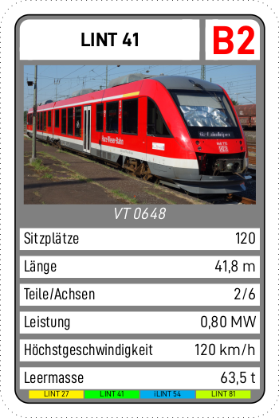
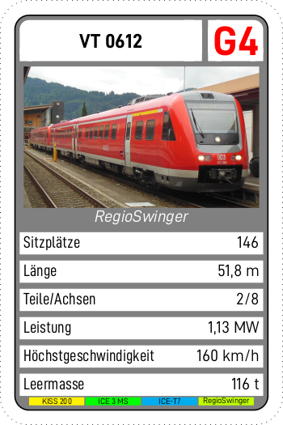

# triebwagen_quartett

Hier gibt es die Vorlage für ein Quartett und die Ausführung davon für
moderne Eisenbahntriebwagen in Deutschland.

# Kompilieren

Die Vorlage ist in TeX geschrieben und benutzt sowohl jpg-Dateien als
auch das package pstricks, weswegen eine Kompilierung mit xelatex
empfohlen wird.

    xelatex -output-driver="xdvipdfmx -i xdvipdfmx.cfg -q -E" quartett.tex
    pdfjam -o ../duplex.pdf quartett.pdf 1,5,2,6,3,7,4,8

# Lizenz

Dieses Werk und alle darin enthaltenen Dateien und Bilder, die nicht im
nächsten Abschnitt „Abweichende Lizenzen“ beschrieben sind, sind unter
einer Creative Commons Lizenz vom Typ Namensnennung - Weitergabe unter
gleichen Bedingungen 4.0 Deutschland CC BY-SA 4.0 zugänglich. Der
Volltext dieser Lizenz ist in der Datei LICENSE zu finden.
Urheberrechtsbesitzer ist, soweit nicht anders angegeben, Bjørn Bäuchle
&lt;quartett at frankfurtium dot de&gt;

## Abweichende Lizenzen

- Die verwendeten Font-Dateien wurden unter der [SIL Open Font
  License](https://scripts.sil.org/cms/scripts/page.php?site_id=nrsi&id=OFL)
  von
  [fontsarena.com](https://fontsarena.com/blog/free-din-font-and-alternatives/)
  erhalten und werden unter der gleichen Lizenz weitergegeben.
- Alle Bilddateien, zu denen es eine gleichnamige Datei Endung .license
  gibt, stehen unter der darin angegebenen Lizenz. Diese Lizenz ist
  jeweils auch im EXIF-Tag als Kommentar hinterlegt.

# Beispiele

